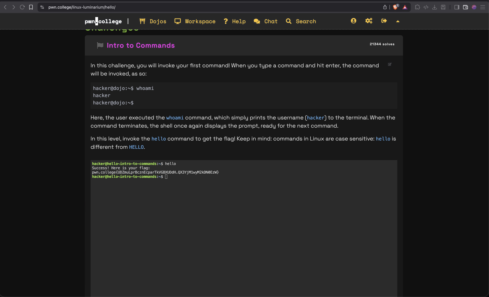
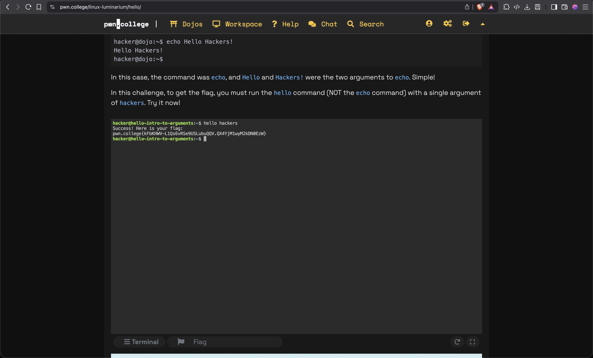
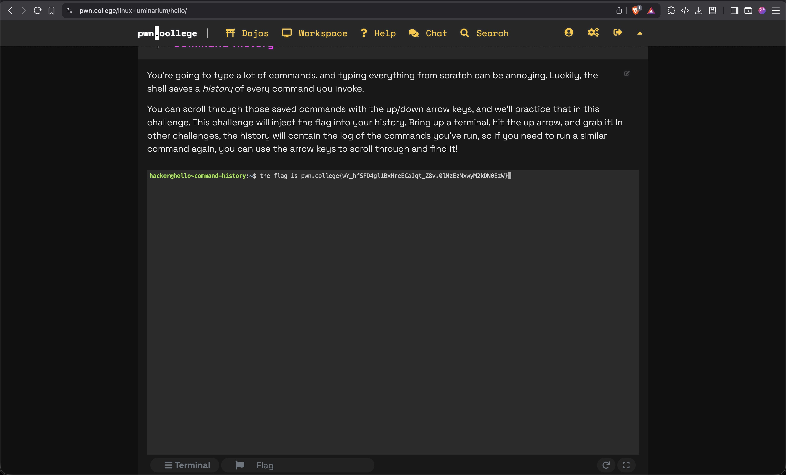
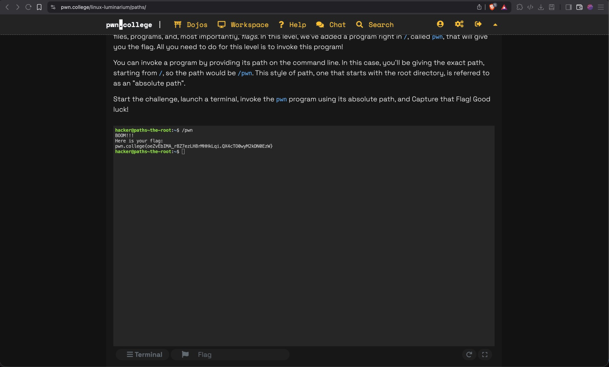
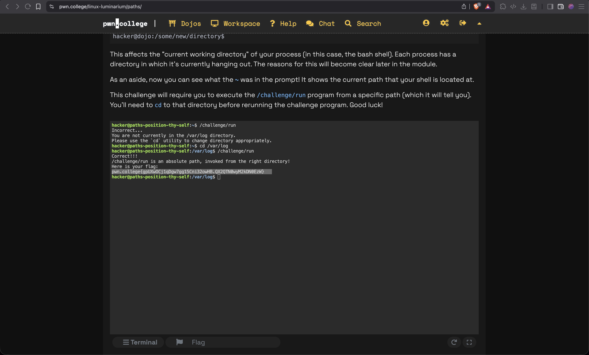
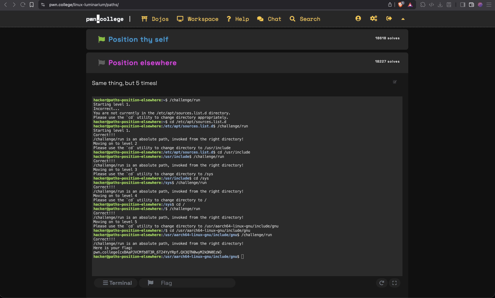
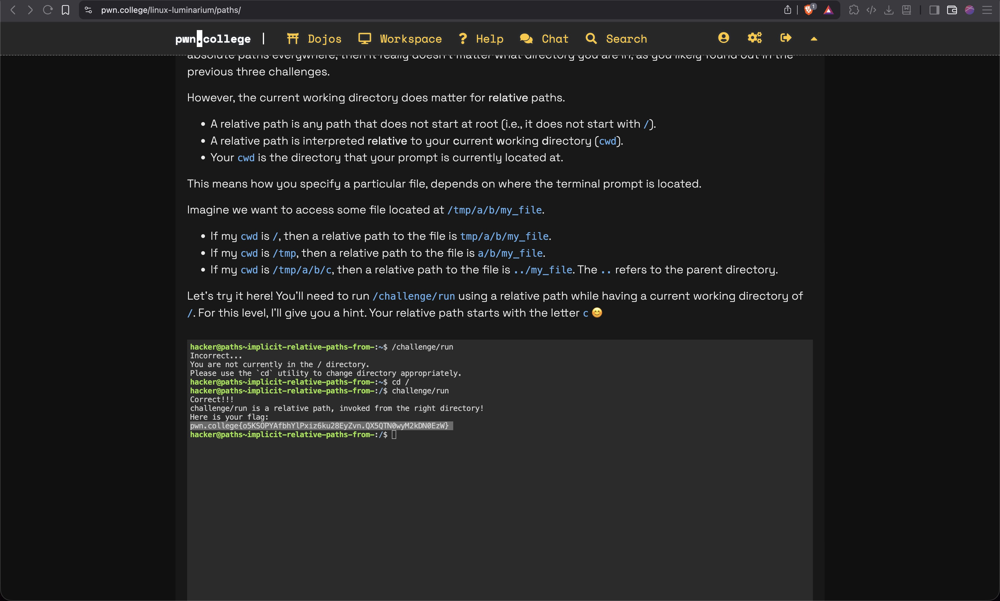
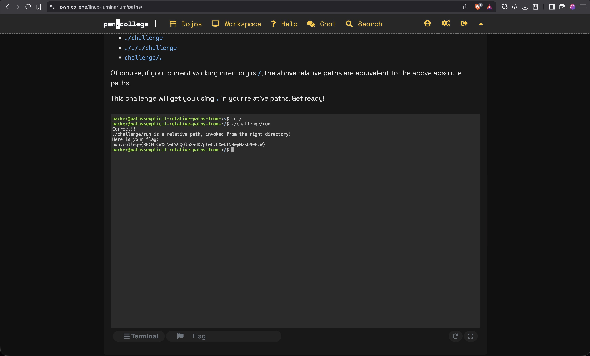
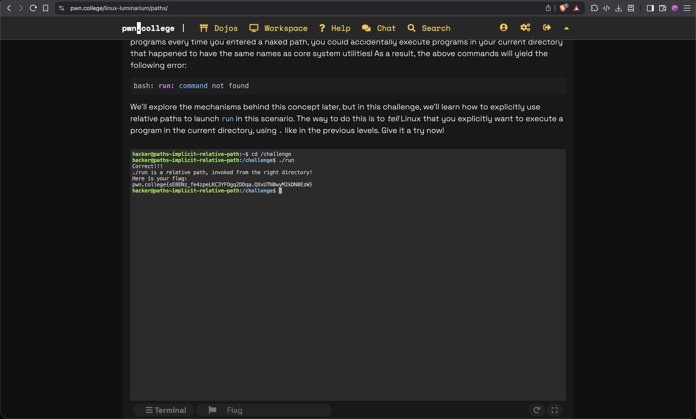
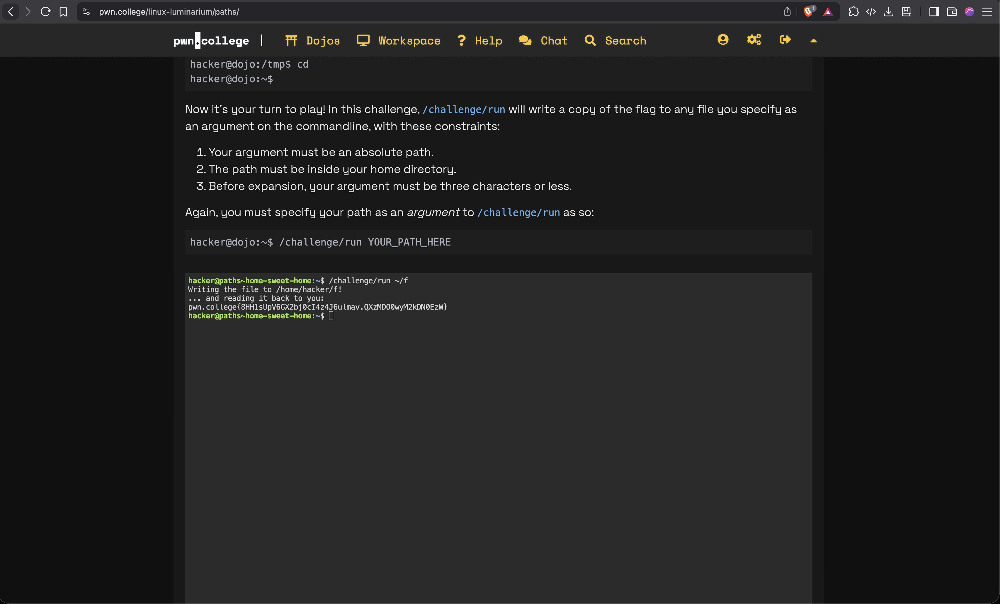

# 1. Hello Hackers
This module will teach you the VERY basics of interacting with the command line! The command line lets you execute commands.
## Challenges:

1. Intro to Commands <br>
The challenge simply asks us to invoke the hello command to get the flag.Upon doing so we get the flag


- Flag:
```
pwn.college{UDZmuLprBcznEcparTkVGBXUDdH.QX3YjM1wyM2kDN0EzW}
```
<br>

2. Intro to Arguments<br>
The challenge asks us to use the 'hello' command with an argument 'hackers'.Upon doing so the flag is visible.


- Flag:
```
pwn.college{kFbKHWV-L1Qs6vRSe9USLubuQQV.QX4YjM1wyM2kDN0EzW}
```
<br>

3. Command History<br>
The flag has been injected in our command history,the challenge is it to retrieve it by scrolling through the saved commands.


- Flag:
```
pwn.college{wY_hfSFD4gl1BxHreECaJqt_Z8v.0lNzEzNxwyM2kDN0EzW}
```

***

# 2. Pondering Paths
This module will teach you the basics of Linux file paths!

## Challenges:
1. The Root<br>
The challenge is to find the flag by invoke a program.The absolute path for the program  is given.


- Flag:
```
pwn.college{oeZvEbIMA_r8Z7ezLH8rMHHkLqi.QX4cTO0wyM2kDN0EzW}
```

2. Program and absolute paths <br>
The challenge requires us to run a program by invoking its absolute path.


- Flag:
```
pwn.college{ktate3d269ag42lrh6dDWvBXY2m.QX1QTN0wyM2kDN0EzW}
```

3. Position thy self <br>
The challenge requires us to change the current working directory and execute a program for which the path from working directory is given.


- Flag:
```
pwn.college{gpUXwOCj1qDgw7gg15Cni32owHB.QX2QTN0wyM2kDN0EzW}
```

4. Position elsewhere <br>
The challenge requires us to change the current working directory 5 times and execute a program each time to find the succesive working directory.The 5th directory has the program , which upon executing gives us the flag.


- Flag:
```
pwn.college{cxBAaPJVCMfb8T3R_6T24YyYRpf.QX3QTN0wyM2kDN0EzW}
```

5. implicit relative paths,from /<br>
The challenge requries us to change current working directory,then invoke the relative path of the program.


- Flag:
```
pwn.college{o5KSOPYAfbhYlPxiz6ku28EyZvn.QX5QTN0wyM2kDN0EzW}
```

6. explicit relative paths,from /<br>
This challenge requires us to use '.' in our relative path


- Flag:
```
pwn.college{8ECHfCWXsNwUW9QOl68SdD7ptwC.QXwUTN0wyM2kDN0EzW}
```

7.implicit relative path <br>
The challenges requires us to use '.' to overcome the safety measure of not being able to run programs with naked paths in current directory.


- Flag:
```
pwn.college{sE8ENz_fe4zpeLKC3YFOgq2DDqa.QXxUTN0wyM2kDN0EzW}
```

8. home sweet home <br>

The challenge requires us to give a path argument that is 3 characters or less. We use ~ to make a path in our home directory, so ~/f works and writes the flag to the file 'f'.


- Flag:
```
pwn.college{8HH1sUpV6GX2bj0cI4z4J6ulmav.QXzMDO0wyM2kDN0EzW}
```

***
