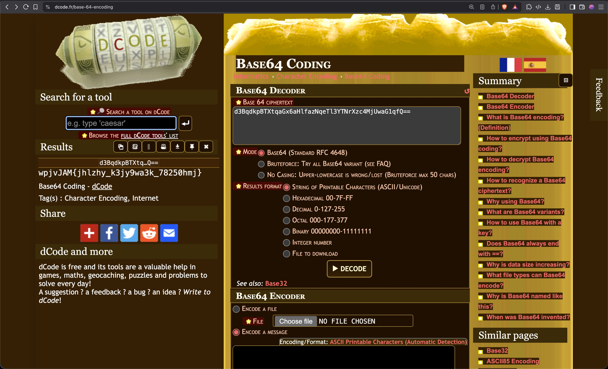
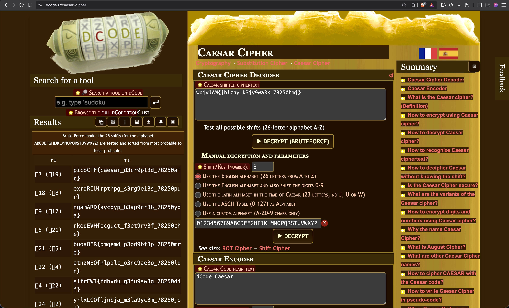

# interencdec

Can you get the real meaning from this file.
Download the file here.

## Solution:

1.The file has the following text:
```
YidkM0JxZGtwQlRYdHFhR3g2YUhsZmF6TnFlVGwzWVROclh6YzRNalV3YUcxcWZRPT0nCg==
```
The '==' make me immediately think that this base 64 string

2.I use a base64 decoder and get the following:
```
b'd3BqdkpBTXtqaGx6aHlfazNqeTl3YTNrXzc4MjUwaG1qfQ=='
```
The result looks like a base64 string.This makes me believe that the data has been encoded multiple times.


3.I again use a base64 decoder and input the base64 string we got after remove the b''.I get the following result
```
wpjvJAM{jhlzhy_k3jy9wa3k_78250hmj}
```


4.I try decoding the string we got with a ceaser cipher decoder


## Flag:

```
picoCTF{caesar_d3cr9pt3d_78250afc}
```

## Concepts learnt:

- The length of a base64 string has to be a multiple of 4
- The "=" symbol is commonly used for padding at the end

## Resources:
- Base64(https://en.wikipedia.org/wiki/Base64)
- ceaser cipher decoder(https://www.dcode.fr/caesar-cipher)
- base64 decoder(https://www.dcode.fr/base-64-encoding)


***